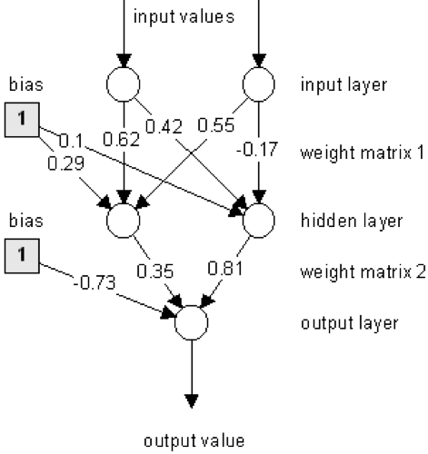

Few samples of simple data science projects.

- **Machine Learning-Cheat Sheet:** Simplified Cheat Sheet for data science pipeline and Machine Learning implementation of Linear Regressin, Logistic Regression, SVM, Random Forest, Liniar Discriminant, Ensemble Bagging and Neural Networks.

- **NN implementation:** Neural Network and the stochastic gradient descent algorithm from scratch in Python.

- **Movie Budget Analysis:** Data analysis and data visualization for movie data
